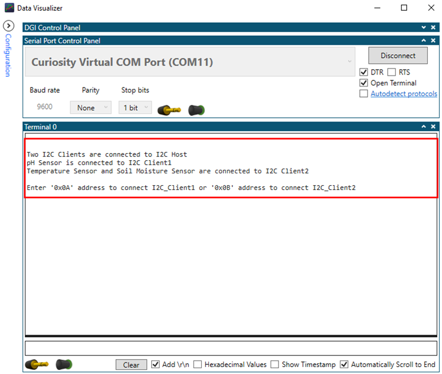
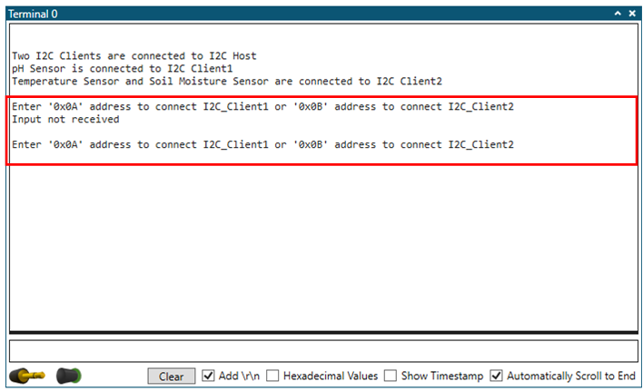
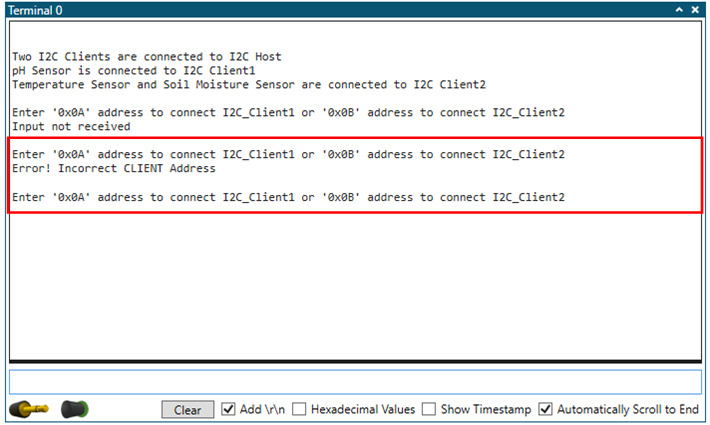
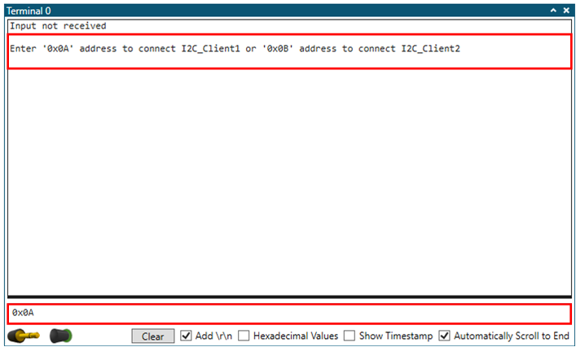
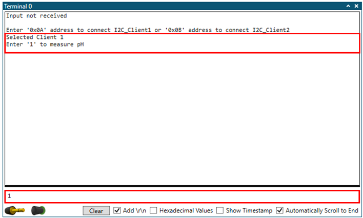
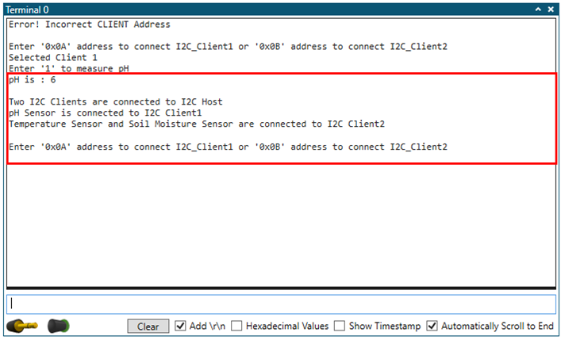
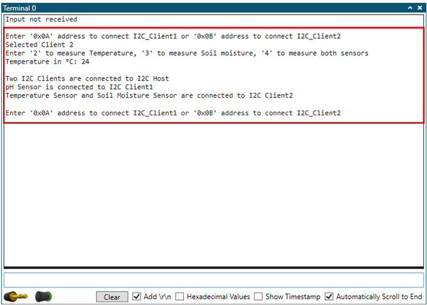
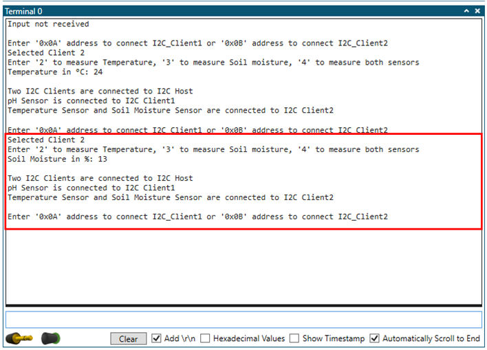
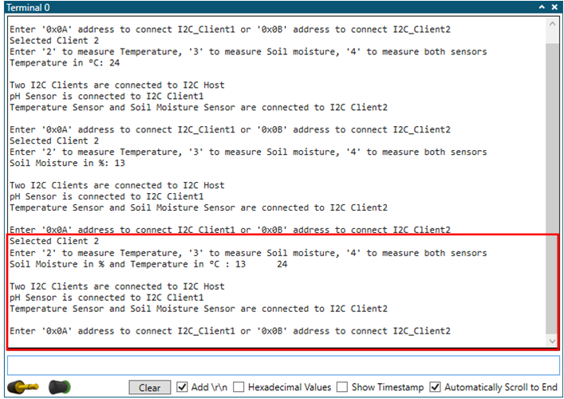

<!-- Please do not change this logo with link -->

# UART-I2C Bridge and I2C Host Implementation using PIC16F15244 Microcontroller

## Introduction

Enhanced Universal Synchronous Asynchronous Receiver Transmitter (EUSART) and Inter Integrated Circuit (I2C) are  the most commonly used serial interfaces in embedded applications for communication with the external integrated circuits. Both these serial interfaces can be used to enable communication between microcontrollers or microprocessors and also useful for interfacing IC modules supporting these serial interfaces to microcontrollers. Additionally, the EUSART interface is capable of communicating  with terminal application on a personal computer. In some of the high-end applications, the microcontrollers, or microprocessors might fall short of USART peripheral instances or not supported by EUSART or I2C interface for communication with external ICs. In such applications, the PIC16F15244 family microcontrollers can be used as a secondary microcontroller and act as USART-I2C bridge.

This code example highlights a good use case where PIC16F15244 family microcontrollers can be used as USART-I2C bridge. It demonstrates how the user entered input commands on the PC terminal window is received by the host device through EUSART interface. According to the input commands received, host device initiates I2C communication with the multiple client devices.

## Related Documentation

- [PIC16F15244 Product Family Page](https://www.microchip.com/en-us/products/microcontrollers-and-microprocessors/8-bit-mcus/pic-mcus/pic16f15244)
- [PIC16F15244 Code Examples on GitHub](https://github.com/microchip-pic-avr-examples?q=pic16f15244&type=&language=&sort=) 
- [PIC16F15244 MCU Family Video](https://www.youtube.com/watch?v=nHLv3Th-o-s)
- [PIC16F15244 MCU Product Page](https://www.microchip.com/en-us/product/PIC16F15244)
- [Technical Brief - Using the MSSP in I2C Master mode](https://www.microchip.com/wwwappnotes/appnotes.aspx?appnote=en1001796)
- [Technical Brief – Using the MSSP in I2C Slave mode](https://www.microchip.com/wwwappnotes/appnotes.aspx?appnote=en1001796)
- [Application Note – AN3538 A Simple Water Monitoring System with I2C Communication](http://ww1.microchip.com/downloads/en/Appnotes/A-Simple-Water-Monitoring-System-with I2C-Communication-DS00003538A.pdf)

## Description 

In this code example, the PIC16F15244 microcontroller communicate with Data Visualizer terminal window application, running on a PC, through USART interface and receive user inputs/commands. Based on the commands received from the user, the PIC16F15244 microcontroller communicates with the I2C client devices and collect the required sensors data and, transmit to PC for displaying it on the terminal window. This way, the PIC16F15244 microcontroller acts as a EUART-I2C bridge to communicate with Data Visualizer terminal window application and acts as a I2C host device to communicate with the I2C client devices.

The code example uses two I2C clients, named as client 1 and client 2 and, they are based on PIC16F15244 microcontroller. Below Figure 1 shows the block diagram view of the application.

  
   Figure 1 : Block diagram view of the application 

For the purpose of demonstration, pH sensor is interfaced to client 1 and, temperature and capacitive soil moisture sensors are interfaced to client 2. Both the clients periodically collect data from the sensors, process the acquired data and keep the data ready to transmit to Host device over I2C interface. 

The input commands and clients I2C address information has been displayed on the terminal window of data visualizer. The user needs to enter a client device address from where the sensor data needs to be collected. If the entered client device address is correct, then the next input command, asking the user to enter sensor information from where data needs to be collected, is displayed on the terminal window. After entering the correct sensor information, the host device establishes I2C communication with the respective client device and requests to send the processed sensor data. The client device responds back to host request with the processed sensor data. Upon receiving the sensor data, the host device transmits data to data visualizer tool through UART interface, for displaying it on the terminal window. If the user entered client address or sensor input command is incorrect, then terminal window display the supplied client address or sensor information is incorrect and requests the user to re-enter details.

## Software Used

- [MPLAB® X IDE 5.50 or newer](http://www.microchip.com/mplab/mplab-x-ide)
- [MPLAB® XC8 2.20 or a newer compiler](http://www.microchip.com/mplab/compilers)
- [MPLAB® Code Configurator (MCC) v5.0.3 or newer](https://www.microchip.com/mplab/mplab-code-configurator)
- [MPLAB® Code Configurator (MCC) Device Libraries PIC10 / PIC12 / PIC16 / PIC18 MCU](https://www.microchip.com/mplab/mplab-code-configurator)
- [Microchip PIC16F1xxxx Series Device Support (v1.8.149) or newer](https://packs.download.microchip.com/) 
- [Standalone Data Visualizer v2.20.674 or newer](https://www.microchip.com/en-us/development-tools-tools-and-software/embedded-software-center/atmel-data-visualizer)

**Note:** 

 1. ***Integrated MPLAB Data visualizer can also be used as a terminal window.***
 2. ***For running this demo, the installed tool version should be same or later. This example is not tested with the previous versions.***

## Hardware Used

- Curiosity Nano Base for Click boards™[AC164162](https://www.microchip.com/en-us/development-tool/AC164162)
- PIC16F15244 Curiosity Nano Evaluation Kit [EV09Z19A](https://www.microchip.com/en-us/development-tool/EV09Z19A)
- SHT AN Click [MIKROE-3984](https://www.mikroe.com/sht-an-click)
- PH Sensor [EC-4743](https://www.electronicscomp.com/analog-ph-sensor-kit-for-arduino?gclid=EAIaIQobChMIhfv3t-q58QIVu4NLBR2VKQGWEAYYAyABEgKhdPD_BwE)
- Capacitive Soil Moisture Sensor V2.0 [EC-5092](https://www.electronicscomp.com/capacitive-soil-moisture-sensor-v2?gclid=EAIaIQobChMI3YCgheq58QIVxZVLBR1PZQKPEAQYAiABEgJW9_D_BwE)

## Application Firmware:

This example is supplemented with three standalone firmware packs named as host firmware, client 1 firmware and client 2 firmware. 

The host firmware handles command line interface which allows the user to enter input commands on the terminal window of data visualizer. Depending on the user input commands, host device initiates I2C communication with the relevant client devices. The host device requests the client device to send processed data of a specific sensor through I2C interface and displays the received data on terminal window. 

The client firmware periodically acquires the connected sensor data through ADC interface, process the raw ADC data, and store at a designated location in data memory. Then after, the client device goes to sleep mode. The client device wakes up from the sleep mode only when I2C Start bit is detected or sleep period is elapsed. If I2C start bit is detected, client device reads the requested sensor data from memory and send to the host device through I2C interface. Whereas if timer wait period is elapsed, then client device measures the connected sensor data, process data and store it at the designated location in data memory. If there is no further activity on the I2C interface for certain period, the client device enters the sleep mode.

## Hardware Setup:

The PIC16F15244 Curiosity Nano evaluation kit is used to setup host and client devices. The following figure shows hardware setup of the application and interconnections between the host and client boards. Refer hardware connection details table for more information. 

  
   Figure 2 : Hardware Setup connections 

## Hardware Connection details:

Host microcontroller pin connection details.

| Microcontroller pin | Peripheral | Signal Description |
|:----------:|:-----------:|:---------:|	
| RB4	| I2C peripheral	        | Serial Clock	| 	
| RB6 	| I2C peripheral	        | Serial Data	|  
| RC1 	| EUSART peripheral 	        | RX            |  
| RC0 	| EUSART peripheral     	| TX	        | 

Client 1 microcontroller pin connection details

| Development board/Click board| Microcontroller pin| Peripheral| Signal description|
|:----------:|:-----------:|:---------:|:---------:|	
| PIC16F15244 Curiosity Nano board| RB4| I2C peripheral | Serial Clock	| 	
| PIC16F15244 Curiosity Nano board| RB6| I2C peripheral	| Serial Data	|  
| Ph Sensor| RC4| GPIO | PH sensor output|  

	
Client 2 microcontroller pin connection details

| Development board/Click board| Microcontroller pin| Peripheral| Signal description|
|:----------:|:-----------:|:---------:|:---------:|	
| PIC16F15244 Curiosity Nano board| RB4| I2C peripheral | Serial Clock	| 	
| PIC16F15244 Curiosity Nano board| RB6| I2C peripheral	| Serial Data	|  
| SHT AN click| RB7| GPIO | Temperature sensor output|  
| SHT AN click| RC7| GPIO | Channel selection |
| Soil Moisture sensor| RC4| GPIO | Soil sensor output|

Steps to open Terminal window in Data Visualizer:

Use the terminal window of standalone data visualizer tool to receive user input through PC keyboard and to display the processed sensor data. Follow the below steps to open terminal window.

1. In the data visualizer window, click on Configuration tab.
2. In the Modules section, expand External connection option and then double click on Serial port.
3. From Serial Port Control Panel, select the Curiosity Virtual Com Port which is connected to the host device.
4. Check the “Open Terminal” option.
5. Check the “Add \r\n” option which allows the user to enter input command on terminal window as shown in figure below.
6. Click on Connect button and then terminal window is opened.

  
   Figure 3 : Data Visualizer 

## Demo Operation:

• Connect the hardware as shown in the Hardware Setup section . Power up the host and two client boards using micro-B USB cable. 
• Load the host application firmware to the PIC16F15244 Curiosity Nano board which is connected to the client 1 and client 2 through I2C interface.
• Load the client 1 application firmware to the PIC16F15244 Curiosity Nano board with ph sensor interface. 
• Load the client 2 application firmware to the PIC16F15244 Curiosity Nano with Temperature and Soil moisture sensor interface. 
• Initially client device address and sensor information is displayed on terminal window as shown in the figure below.

  

• If user fails to provide input command within 15 sec of duration , then host microcontroller displays the text “Input not received” and  again asks the user to re-enter input command as shown in the below figure.

  

• If incorrect client device address is entered, then displays the text “Error! Incorrect CLIENT Address” and again asks user to re-enter input command as shown in the below figure
 

  

• Enter client 1 device address “0x0A” on the  terminal window as shown in below figure.

  

• After entering the client address, displays next input command on the terminal window. Then enter input “1” to select the pH sensor ,which is interfaced to the client 1 device as shown in below figure.

  

• Measured sensor data transmitted from the client 1 device through I2C interface is displayed on  the terminal window as shown in fig below. After that again sensor information and input commands are displayed on the terminal window.

  

• Enter client 2 device address 0x0B and observe if entered address is correct, then displays the text “Selected Client  2” on terminal window. Then displays the next input command and enter input 1 to select the temperature sensor which is interfaced to the client 2 device. Transmitted temperature data through I2C interface is displayed on terminal window as shown in below figure. After that again sensor information and input commands are displayed on the terminal window.

  

• Again, enter client 2 device address 0x0B and enter input “2” to select soil moisture sensor data which is interfaced to the client 2 device.  Transmitted  soil moisture data through I2C interface is displayed on terminal window as shown in below figure.  After that again sensor information and input commands are displayed on the terminal window.

  

• After entering client 2 device address, enter input “4”  to select both the sensors which are interfaced to the client 2 device.  Both sensors’ data transmitted through I2C interface is displayed on the terminal window as shown in the below figure.

  

## Conclusion:

Many real time applications require EUSART-I2C bridge to connect microcontroller to other devices like PC, Microprocessor, or IC Modules. It can also be used for the remote debug of i2c devices via an external PC or terminal program like Tera Term, Putty etc... This code example demonstrates EUSART-I2C bridge implementation between PC and PIC16F15244 family of microcontrollers.

